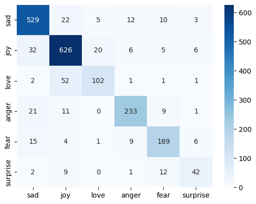
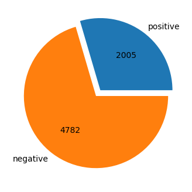
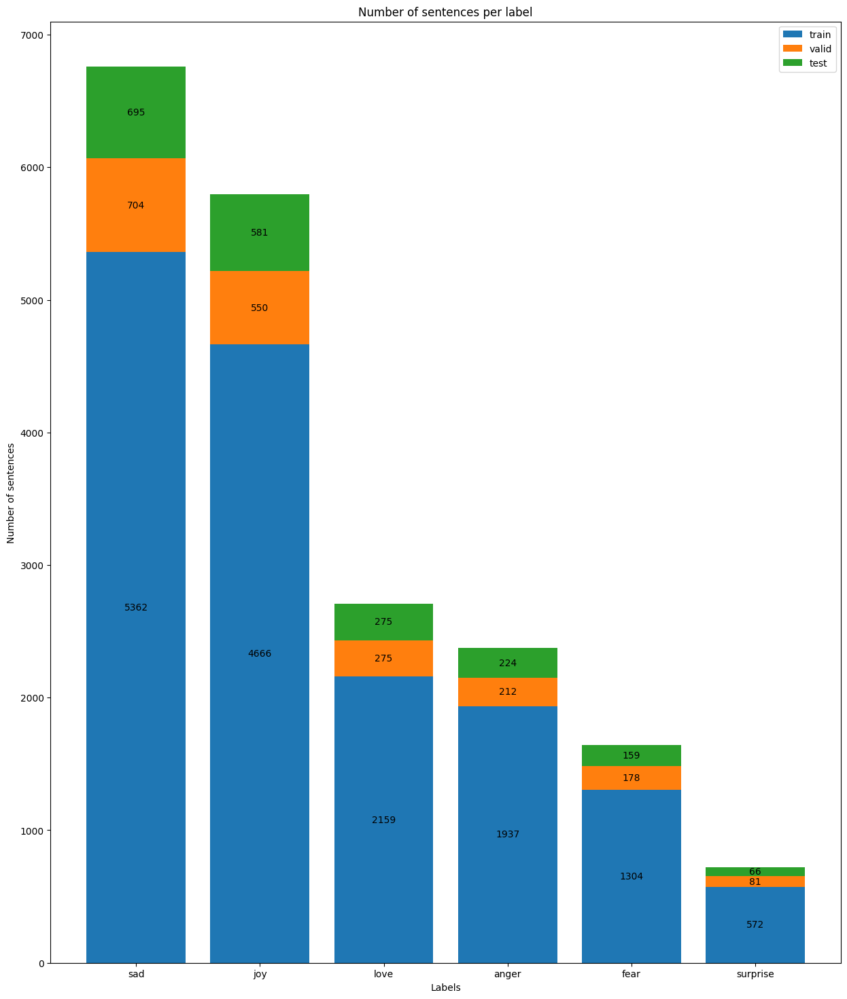

# Multi-Dimensional Sentiment Analysis

This project, developed as part of the AI4ALL program, leverages advanced data analysis and machine learning techniques to extend the capabilities of traditional sentiment analysis beyond simple positive/negative recognition. By aiming to predict a broader range of human emotions from text, this work seeks to enhance the interpretative capabilities of AI systems across diverse demographic backgrounds.

## Problem Statement <!--- do not change this line -->

Traditional sentiment analysis often limits its scope to detecting positive or negative sentiments. This project addresses the need for a more nuanced approach that can discern a spectrum of human emotions from textual data, thus providing deeper insights for applications such as aiding neurodivergent individuals in social interactions, enhancing brand management on social media, and supporting linguistic research.

## Key Results <!--- do not change this line -->

1. **Development of a Multi-Dimensional Sentiment Analysis Model:** Achieved an accuracy of 0.86 and an F1-score of 0.85, indicating robust performance across varied emotional states.
2. **Implementation of Advanced Machine Learning Techniques:** Utilized algorithms such as Support Vector Machines, Naive Bayes, Random Forests, and k-Nearest Neighbors to classify emotional content effectively.
3. **Comprehensive Dataset Usage:** Employed diverse datasets, including the "Sentiment Analysis Word Lists" and "Emotion Dataset for Emotion Recognition Tasks" from Kaggle, to train and test the models.

## Methodologies <!--- do not change this line -->

The project combined several machine learning techniques to analyze sentiment and emotions from text data:

- **Support Vector Machines and Naive Bayes** for baseline sentiment analysis.
- **Random Forests and k-Nearest Neighbors** for classifying complex emotional states.
- **Data Visualization & Preparation:** Employed techniques to understand data distribution and prepare datasets for training.
- **Model Training and Validation:** Developed models and validated them using accuracy metrics and confusion matrices.

## Data Sources <!--- do not change this line -->

- [Sentiment Analysis Word Lists Dataset by *Prajwal Kanade*](https://www.kaggle.com/datasets/prajwalkanade/sentiment-analysis-word-lists-dataset)
- [Emotion Dataset for Emotion Recognition Tasks by *Parul Pandey*](https://www.kaggle.com/datasets/parulpandey/emotion-dataset)

## Technologies Used <!--- do not change this line -->

- Python
- Data Scince Libraries (seaborn, numpy, matplotlib, scipy)
- Machine Learning Libraries (scikit-learn, pandas)
- Jupyter Notebooks
- Google Colab

## Authors <!--- do not change this line -->

This project was completed in collaboration with:
- Jenna Kudaimi, [jkudaimi@berkeley.edu](mailto:jkudaimi@berkeley.edu)
- Hiep (Roger) Nguyen, [hiepnguyenduc2005@gmail.com](mailto:hiepnguyenduc2005@gmail.com)
- Aniket Shirodkar, [shirodkar.aniket@gmail.com](mailto:shirodkar.aniket@gmail.com)

## Acknowledgements
We thank AI4ALL for the opportunity to engage with cutting-edge AI research and development, enriching our understanding and skills in the field.

